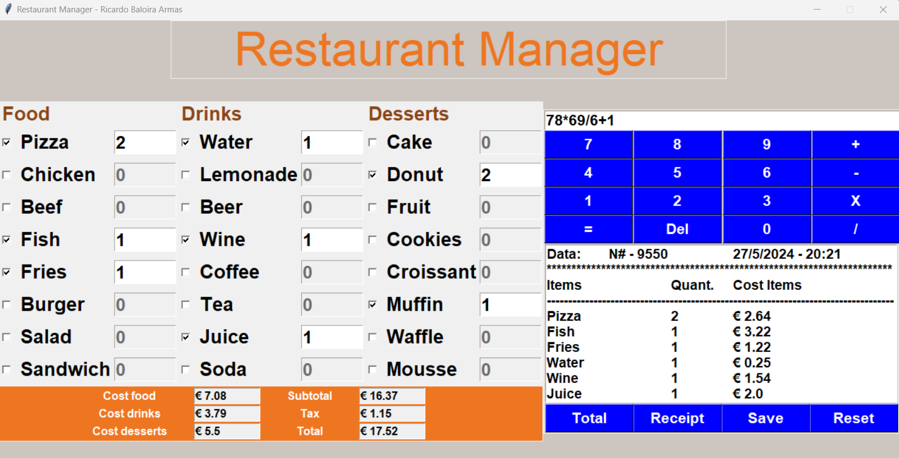
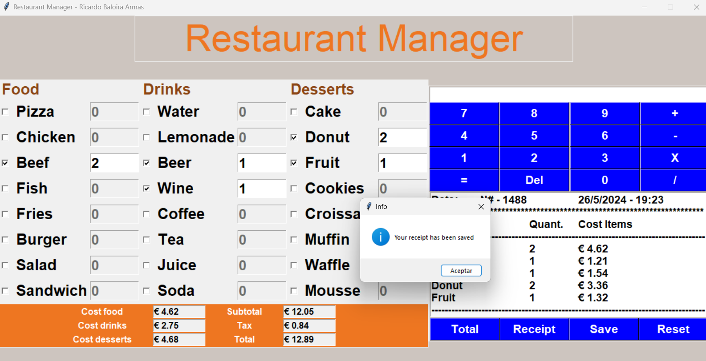
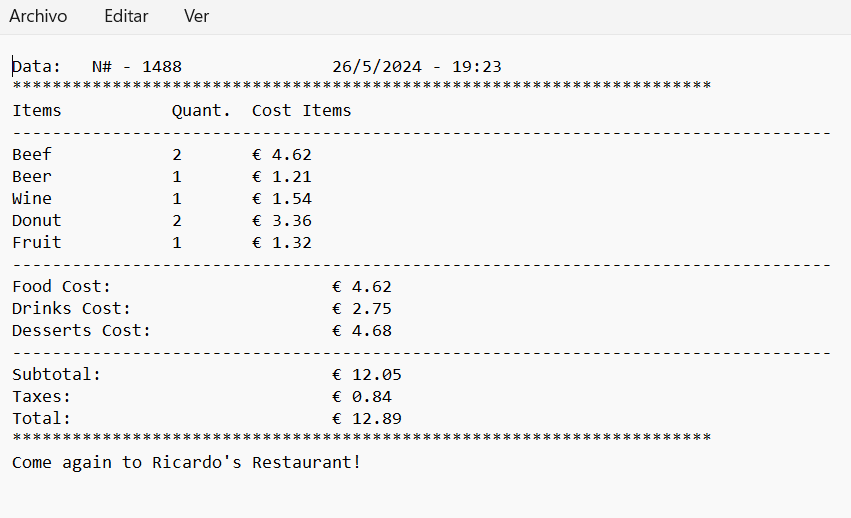

# restaurant-manager
Restaurant manager made with <b>Python</b>. It offers its user a way to keep track of a <b>restaurant's transactions</b>, allowing also the creation and saving of <b>receipts</b> and additional matemathic operations with an in-built <b>calculator</b>, in case is needed.
 
 

| [📖 Features](#features) | [:camera: Screenshots](#screenshots) |
|  -------- | ----------- |

 

## Features

* **User-friendly interface:** Displays three lists with all the types of food, drinks and desserts, allowing the user to easily check the products selected by the client and input how many dishes were ordered of each one.
 
 
* **Detailed costs:** Calculates costs of the food, drinks and desserts, subtotal, tax and the total of everything combined.
 

* **In-built calculator:** Allows the user to perform any operation (+, -, *, /) on numbers containing decimal points.
 

* **Receipt creation:** Creates a receipt with all the data, once calculated the total costs, and allows the user to save it as a .txt file on his own device.
 

 

## Screenshots

## Contributing
If you want to contribute to this proyect, follow these steps:

 

1. Fork the repository.
3. Clone your fork.
4. Check that your fork is the "origin" remote.
5. Add the project repository as the "upstream" remote using `git remote add upstream https://github.com/ricardobar96/restaurant-manager.git`.
6. Pull the latest changes from upstream into your local repository using `git pull upstream master`.
7. Create a new branch using `git checkout -b BRANCH_NAME`.
8. Make your changes and commit them: `git commit -m 'DESCRIPTION OF CHANGES'`.
9. Push your changes to your fork `git push origin BRANCH_NAME`.
10. Create a pull request.
 
 

If you have any doubts, consult [this](https://www.dataschool.io/how-to-contribute-on-github/) guide

 

## License
This project is licensed under the [MIT License](LICENSE.txt).
